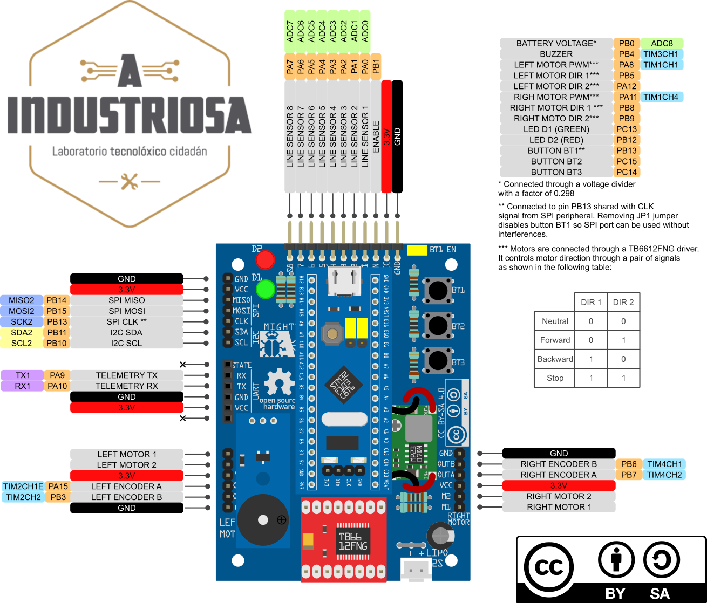

# RustyBugA Control board

Control board for the line follower racing car project designed at [A Industriosa](https://aindustriosa.org/).

## Releases

Version | Description | Status
------------ | ------------- | ------------
[v1](v1/README.md) | Initial board design. Has a mayor supply problem with the AMS1117-3.3 regulator. **Do not use unless you replace the regulator with a more capable one.** | Released
[v1.1](v1.1/README.md) | Updated version of v1 that solves the supply problems by replacing the regulator with a MP2307DN. | Released

## Sponsor

Esta actividade está patrocinada pola Xunta de Galicia e pola Axencia Para a Modernización Tecnolóxica (AMTEGA).